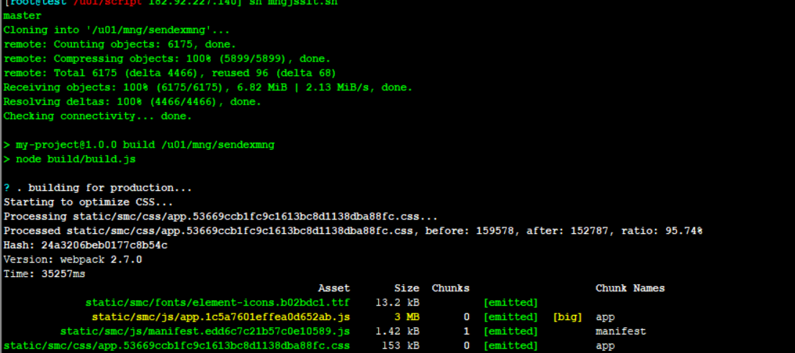
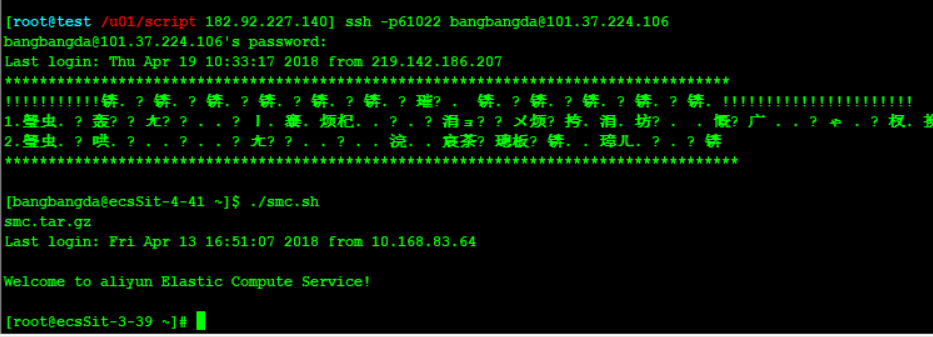

## 寄件管理后台 ##

> 使用 Vue^2.3.3 + element-ui^1.3.7+ vue生态圈搭建项目


### 线上打包发布 ###
> 使用 vue-cli 脚手架进行打包，线上 使用 [pm2](https://www.douban.com/note/314200231/)起node 服务. 服务配置文件


#### 前端发版步骤 ####

 - 登录发布服务器(使用xshell)
    ```
     ssh -p61031 root@182.92.227.140
     pwd:Bbd.com222@)!*
    ```
 -  打包并将文件传输给跳板机
    ```
      cd /u01/script
      sh mngjssit.sh  // 输入分支名 sit， master,
    ```
    

    ```
     expect mngsit.exp
    ```
 - 进入跳板机
    ```
       ssh -p61022 bangbangda@101.37.224.106
       pwd:Sitbbd
       ./smc.sh
    ```

    

- 登录服务器，解压文件
    ```
      cd /data
      rm -rf smc
      tar -zvxf smc2017-08-xx-xx.tar.gz
    ```

- 找到当前进程，杀掉,pm2自动重启。
     ```
       ps -ef|grep node
       kill -9 xxxx

     ```
