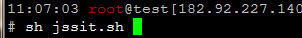

## 我的快递 - c端  ##


### 前端相关技术 ###

 - fastClick/1.0.6
    - [文档](https://github.com/ftlabs/fastclick)
    - [引入源码](https://a.alipayobjects.com/static/fastclick/1.0.6/fastclick.min.js)

 - zepto/1.1.3
   - [文档](http://www.css88.com/doc/zeptojs_api/)
   - [引入源码](https://a.alipayobjects.com/amui/zepto/1.1.3/zepto.js)

 - antUI/10.1.10
    - [文档](https://antui.alipay.com/10.1.10/index.html)

 - JsAPI
    - [老版文档入口-目前使用](https://myjsapi.alipay.com/jsapi/native/start-continuous-location.html#3__E5_87_BA_E5_8F_82)
    - [文档](https://myjsapi.alipay.com/)
    - [最新小程序入口](https://docs.alipay.com/mini/introduce)
 - [支付宝移动端开发规范](http://am-team.github.io/amg/dev-guild.html#注意事项)

### 线上打包发布 ###
> 项目开发，未使用前端框架，使用gulp(目前配置未支持es6语法)进行代码压缩。[gulpfile.js](./libs/gulpfile-pro.js)


#### 前端发版步骤 ####

 - 登录发布服务器(使用xshell)
    ```
     ssh -p61031 root@182.92.227.140
     pwd:Bbd.com222@)!*
    ```
 -  在目录/u01下执行jssit.sh脚本

    

 - 执行后，输入分支。例如： master , sit


 - 打包成功后，拷贝HTML到跳板机。

    

 - 拷贝css，js文件至OSS，[OSS 安装包](./libs/oss-client-aliyun-cn-v1.2.0.0.exe)

   将182.92.227.140服务器/u01目录下以日期为结尾生成文件夹拷贝至OSS，static目录下

   

    - 登录oss，

       ```
        Key    = LTAI3DjPEWhnoUC7
        Secret = lFLG2xigOtBUZd9iYJBGwUoa1q8PT4	 
      ```
       
    - 跳过设置→添加→expresssit
       

    - 将以日期为文件名的文件夹拷贝至static文件夹下

       

 - 登录跳板机
   ```
     ssh -p61022 bangbangda@101.37.224.106
     pwd:Sitbbd

     #sh client.sh

     #sh /data/modify.sh
    // 执行结束。
   ```

### 代码调试 ###
  >项目分为预发环境和生产环境，不同环境的配置文件分别在`/libs/config.sit.js`和`/libs/config.prod.js`文件目录下面。里面分别配置了不同环境下的url。分环境打包具体代码查看gulpfile文件

- 使用Charles 进行抓包调试。

  - 设置代理端口(默认8080，与手机端口对应)

    

    

  - 开启 https代理

    

    

  - 本地服务

    

    
 - 手机访问`chls.pro/ssl ` 安装证书

 [安装包](./libs/Charles-Proxy-4.0.2-Crack.zip)

 [参考文档](https://www.jianshu.com/p/7a88617ce80b)


- Alipay BugMe 调试(目前版本无法使用)

   [安装地址](./libs/Alipay BugMe Setup 0.0.1.exe)

  **以管理员身份运行**,手机支付宝扫描二维码，打开调试开关，返回。

  扫描入口二维码，页面出现小蚂蚁图标，点击进行调试。

  
